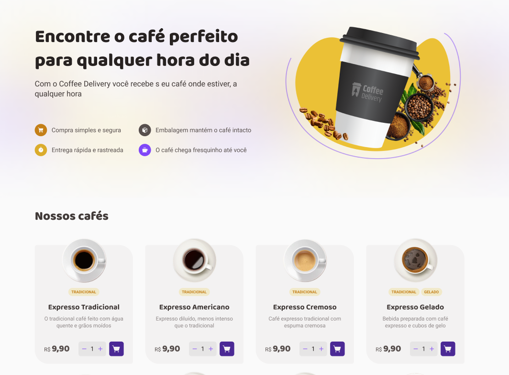

<h1 align="center">
   
</h1>

<div align="center">
   <a href="#desktop_computer-project">
      
   </a>
   <a href="#nail_care-layout">
      
   </a>
   <a href="#technologist-technologies">
      
   </a>
   <a href="#clipboard-how-to-use">
      
   </a>
   <a href="#speech_balloon-contact">
      
   </a>
   <a href="https://coffee-delivery-six-gray.vercel.app/">
      
   </a>
</div>
<br>

## :desktop_computer: Project

Project made through the Ignite course on the [Rocketseat](https://app.rocketseat.com.br/cart/rocketseat-one-black-month-lote-02?referral=joeyanovich&utm_source=platform&utm_medium=organic&utm_campaign=venda&utm_term=mgm&utm_content=indication-lp_one) platform.

Project carried out as the 2nd challenge to reinforce important ReactJS concepts.
It was necessary to develop a to-do-list style task control application, which contains the following functionalities:
- `List of products (coffees) available for purchase`
- `Add a specific number of items to the cart`
- `Increase or remove the number of items in the cart`
- `Form for the user to fill in their address`
- `Display the total items in the cart in the Header`
- `Display the total value of the sum of items in the cart multiplied by the value`
<br>


Concepts that were learned:

- `States`
- `contextAPI`
- `localStorage`
- `immutability of the state`
- `lists and keys in ReactJS`
- `properties`
- `componentization`


## :nail_care: Layout

<br><br>

<div align=center>

</div>


## :technologist: Technologies

- [Vite](https://vitejs.dev/)
- [React](https://react.dev/)
- [Typescript](https://www.typescriptlang.org/)
- [styled-components](https://styled-components.com/)


## :clipboard: How to use

Below are the instructions to access the application:

1. Clone the repository: 
```bash 
https://github.com/joeyanovich/coffee-delivery
```
2. Install all dependencies by using command:
```bash
npm install
```
3. Run the code:
```bash
npm run dev
```


## :speech_balloon: Contact

<br>
<div align="center">
   <a href="mailto:joedison.dias@gmail.com">
      
   </a>
   <a href="https://www.linkedin.com/in/joedisondias/" target="_blank">
      
   </a>
</div>